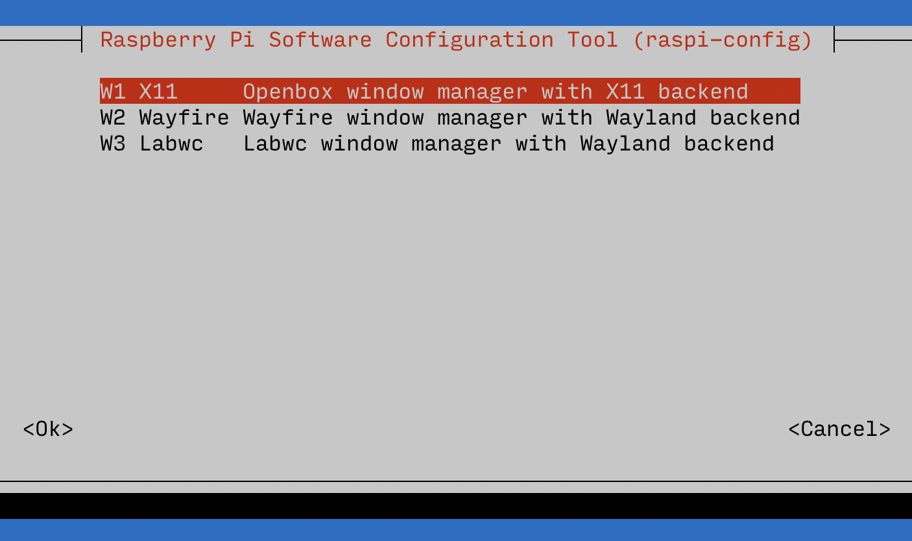
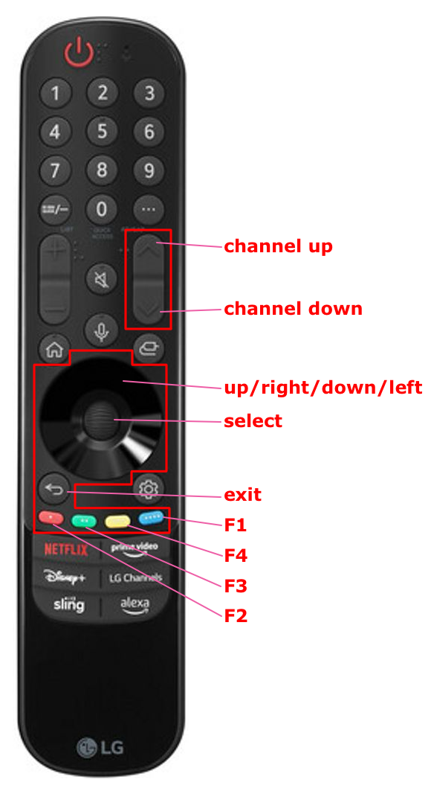

## Controlling Raspberry Pi desktop with TV remote via CEC

It is possible to emulate user input (*mouse and keyboard*) on a Raspberry Pi desktop (*such as [Raspbian](https://raspberrypi.com/software/)*) using TV remote via [CEC](https://en.wikipedia.org/wiki/Consumer_Electronics_Control), when Raspberry Pi is connected to a TV via HDMI.

<!-- MarkdownTOC -->

- [Installation](#installation)
- [Customization](#customization)

<!-- /MarkdownTOC -->

### Installation

``` sh
$ sudo apt install cec-utils xdotool
```

Check what you have on CEC:

``` sh
$ echo scan | cec-client -s -d 1
opening a connection to the CEC adapter...
requesting CEC bus information ...
CEC bus information
===================
device #0: TV
address:       0.0.0.0
active source: no
vendor:        LG
osd string:    TV
CEC version:   1.3a
power status:  on
language:      eng


device #1: Recorder 1
address:       1.0.0.0
active source: no
vendor:        LG
osd string:    Kodi
CEC version:   1.3a
power status:  unknown
language:      eng


device #2: Recorder 2
address:       2.0.0.0
active source: no
vendor:        LG
osd string:    CECTester
CEC version:   1.3a
power status:  on
language:      eng


device #4: Playback 1
address:       3.0.0.0
active source: no
vendor:        Apple
osd string:    some room
CEC version:   2.0
power status:  standby
language:      ???


currently active source: unknown (-1)
```

You don't really need to know any information about those for the purpose of emulating user input with a TV remote, but it is useful to know what devices you have. In my case the `device #2` is my Raspberry Pi, on which I executed this command.

Check that you do in fact have CEC supported, press some buttons on your TV remote while this is running:

``` sh
$ cec-client
```

and search for `key pressed` and `key released` in the output.

Switch to Xorg from Wayland:

``` sh
$ sudo raspi-config
```
```
6 Advanced Options
A6 Wayland
W1 X11
```



and reboot.

Try to move the mouse (*not via SSH, need to use the actual Xorg session on the device*):

``` sh
$ xdotool mousemove_relative -- 100 100
```

Place the [script](https://github.com/retifrav/bash-scripts/blob/master/control-raspberry-pi-desktop-with-tv-remote-via-cec/cec.sh) to `/home/pi/programs/cec.sh` (*or wherever*). Run it and see if you can move the mouse with the TV remote's directional pad:

``` sh
$ cec-client | /home/pi/programs/cec.sh -d
```

Create a launcher script:

``` sh
$ nano ~/programs/pipe-cec.sh
```
``` sh
#!/bin/bash

/usr/bin/cec-client | /home/pi/programs/cec.sh
```

Finally, create a user systemd service:

``` sh
$ nano /home/pi/.config/systemd/user/cec.service
```
``` ini
[Unit]
Description=cec

[Service]
Environment=DISPLAY=:0
ExecStart=/home/pi/programs/pipe-cec.sh
#Restart=always
#RestartSec=10
SyslogIdentifier=cec
#User=pi

[Install]
WantedBy=default.target
```

Without `DISPLAY=:0` it will be failing to perform `xdotool` commands.

Enable and start the service:

``` sh
$ systemctl --user enable cec.service
$ systemctl start cec.service
```

Watch the log and try to press some buttons on the TV remote:

``` sh
$ journalctl --user -u cec.service -f
```

### Customization

Every remote has different buttons, and the only way to know which ones you have is to click through all of them and watch the `cec-client` output:

``` sh
$ cec-client | /home/pi/programs/cec.sh -d
```

In my case of an LG Magic Remote none of the numerical buttons are supported - I simply get no events for pressing them, which is why they are commented out in the script.

Here are the only buttons that do get registered via CEC:



And [LG ThinQ](https://apps.apple.com/us/app/lg-thinq/id993504342) application adds a little bit more:

- `play`/`pause`
- `Fast forward` (*note the capital `F`*)
- `rewind`

but of course using an application is not as convenient as using a TV remote, so these can basically be ignored.
